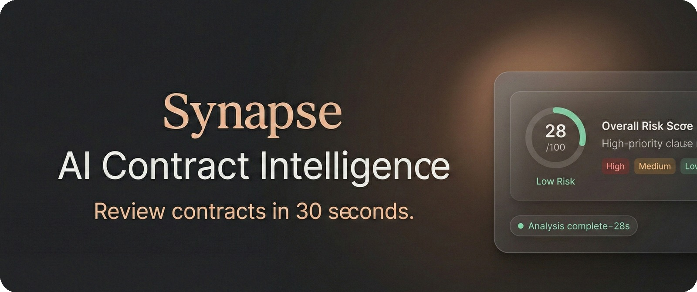

# Synapse

<div align="center">



[](https://nextjs.org/)
[](https://react.dev/)
[](https://www.typescriptlang.org/)
[](https://supabase.com/)
[](https://tailwindcss.com/)
[](LICENSE)
[](../../pulls)

**Enterprise AI Contract Intelligence Platform**

Synapse helps legal and operations teams analyze contracts in minutes, standardize risk review, and accelerate decision-making with auditable AI outputs.

</div>

---

## Executive Summary

Synapse combines AI-powered legal analysis, secure document handling, and a premium review workspace to reduce contract turnaround time while improving consistency and control.

### Business Outcomes
- **Faster review cycles** for NDAs, MSAs, vendor agreements, and internal contracts
- **Standardized risk scoring** across teams and reviewers
- **Clear, explainable outputs** at clause level
- **Lower operational bottlenecks** between legal, procurement, and business units

---

## Core Capabilities

- **AI contract analysis** (clause extraction + risk classification)
- **Clause-level explanations** with actionable context
- **Document ingestion workflow** (upload, parse, analyze, review)
- **Interactive analysis workspace** (dashboard + chat)
- **Secure authentication and data isolation** with Supabase RLS
- **Material Design 3-based UI system** for consistency and scalability

---

## Platform Architecture

### Application Layer
- **Next.js 16** (App Router)
- **React 19 + TypeScript**
- **Tailwind CSS + M3 tokens**

### Intelligence Layer
- **Cerebras Cloud SDK** for model inference
- Analysis API routes for contract review and chat flows

### Data & Auth Layer
- **Supabase** (Auth, Postgres, Storage)
- Row-Level Security for tenant/user isolation

### Document Processing
- `pdfjs-dist` and `tesseract.js` for document parsing / OCR paths

---

## Repository Structure

```text
app/
  api/
    analyze/route.ts
    chat/route.ts
  auth/
    page.tsx
    callback/route.ts
  dashboard/page.tsx
  page.tsx
  globals.css

components/
  analysis-results.tsx
  chat-interface.tsx
  document-list.tsx
  document-upload.tsx
  hero-demo-mockup.tsx
  auth-redirect.tsx

supabase/
  migrations/
```

---

## Security & Data Controls

- Supabase Auth-based identity
- Row-Level Security (RLS) on business tables
- Server-side secret handling (`CEREBRAS_API_KEY` never exposed client-side)
- Controlled API surface via Next.js route handlers

> For production, enforce least-privilege keys, secure callback URLs, environment separation, and audit logging.

---

## Quick Start

### Prerequisites
- Node.js **22+**
- `pnpm` (lockfile is `pnpm@10`)
- Supabase project
- Cerebras API credentials

### Setup

```bash
git clone https://github.com/Chere3/Synapse.git
cd Synapse
pnpm install
cp .env.local.example .env.local
```

Configure `.env.local`:

```env
NEXT_PUBLIC_SUPABASE_URL=
NEXT_PUBLIC_SUPABASE_ANON_KEY=
CEREBRAS_API_KEY=
NEXT_PUBLIC_SITE_URL=http://localhost:3000
```

Apply Supabase migrations from `supabase/migrations/`, then run:

```bash
pnpm dev
```

Open: <http://localhost:3000>

---

## Operational Commands

```bash
pnpm dev      # local development
pnpm lint     # lint checks
pnpm build    # production build validation
pnpm start    # run production build
```

---

## Deployment Guidance

- Promote with CI gates (`lint` + `build`)
- Set production env vars in your host platform
- Configure Supabase auth redirect URLs per environment
- Validate API behavior and RLS before go-live

---

## Contribution Workflow

1. Create a scoped feature branch
2. Keep commits conventional and focused
3. Run `pnpm lint` + `pnpm build`
4. Open PR with verification notes and screenshots for UI changes

---

## License

MIT — see [LICENSE](LICENSE).

---

<div align="center">
  <sub>Synapse · Legal AI Infrastructure for high-velocity teams</sub>
</div>
